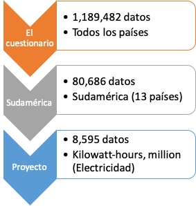

```{r setup, include=FALSE, warning=F}
knitr::opts_chunk$set(echo = F)
knitr::opts_chunk$set(fig.pos = "H", out.extra = "")
options("kableExtra.html.bsTable" = T)
library(tidyverse)
library(gridExtra)
library(ggpubr)
library(knitr)
library(data.table)
library(kableExtra)
library(bookdown)
library(broom)
```


```{r Construcción de bsaes de datos preeliminar, echo=FALSE, eval=TRUE}

data1 <- read.csv(file = "Sudamerica2.csv")
dataFiltered <- select(data1, -c(quantity_footnotes))
dataFiltered <- select(dataFiltered, -1)
newNames <- c("country", "c_transaction", "year", "unit", "quantity", "category")
names(dataFiltered) <- newNames
PIB <- read.csv(file = "PIB.csv", sep = ";", header = TRUE, dec = ",")
PIBpC <-read.csv(file="PibPerCapita.csv", sep = ";", header = TRUE, dec =",")
Pob<-read.csv(file="Pob.csv",sep=";", header = TRUE, dec = ",")

#renombrar filas en Pob para que hacer coincidir los nombres de paises en ambas bases de datos

Pob[Pob == "Bolivia"] = "Bolivia (Plur. State of)"
Pob[Pob == "Brasil"] = "Brazil"
Pob[Pob == "Venezuela"] = "Venezuela (Bolivar. Rep.)"
Pob[Pob == "Trinidad y Tobago"] = "Trinidad and Tobago"

#Cambiar nombre de Pais por country

names(Pob) = c("country","year","Pob")

#Unir dos bases de datos para agregar tamaño poblacional

dataFP <-right_join(x = Pob, y= dataFiltered, by=c("country","year"))

```


# Introducción

El cambio climático ha impulsado la necesidad de cambiar la forma en que se genera electricidad a nivel mundial. Las formas contaminantes de producción como mediante la combustión de material fósil (e.g. petroleo) está dentro de las principales causas del aumento exponencial de los gases invernadero en el siglo pasado. En este contexto, el cambio a formas de generación más "verdes" es una de las estrategias claves en la lucha contra el cambio climático. Dentro de estas formas encontramos las energías renovables, definidas como la energía obtenida desde flujos persistentes y repetitivos que ocurren en ambientes locales [@twidell2015renewable]. Algunas de ellas son la energía solar, eólica (que utiliza el viento como fuente de energía) e hídrica.

Para poder abordar esta problemática la información es vital, es por ello que el trabajo realizado por la división de estadística de las Naciones Unidas (UNDS por sus siglas en inglés) surge como una buena herramienta para monitorear como los distintos países se relacionan con la energía. La UNDS, todos los años genera un base de datos donde registra distintas transacciones energéticas generadas por los países del mundo. Entre estas transacciones podemos encontrar, generación, almacenamiento, importación, exportación, de distintas formas de energía como solar, mareomotriz, termoeléctrica, entre otras. Esta recopilación se le denomina "El cuestionario" [@Globalenergytrade].

Para realizar un análisis exploratorio de esta base de datos un punto de partida es acotar la información. Un buen objeto de estudio es Sudamérica, esto dada la presencia de países con variadas realidades, algunos con poblaciones muy grandes (Brasil y Argentina) y otros con poblaciones pequeñas (Ecuador y Surinam). Otro factor es las grandes diferencias en los tamaños de las economías, dato que puede tener una fuerte influencia en la cantidad de energía que se genera. Es por ello que en este trabajo se plantea como objetivo general, realizar un análisis sobre la producción de electricidad en los distintos países de Sudamérica y tomar como caso particular a Chile, para generar un modelo para predecir la producción de electricidad para los años 2015 a 2019.

**Objetivo de investigación**

- Determinar los países sudamericanos líderes en producción de electricidad según forma de generación entre los años 1990 y 2014.
- Determinar los países sudamericanos líderes en producción de electricidad per cápita entre los años 1990 y 2014.
- Generar un modelo lineal para proyectar la producción de energía entre los años 2015-2019 para Chile, usando como variables el tamaño de la población y el PIB.

# Metodología


## Filtrar base de datos de la UNDS

La base de datos generada por la UNDS, "El Cuestionario", cuenta con más de 1 millón de datos que recopilan información sobre el uso, almacenamiento, importación, generación de energía entre otras transacciones. Esto para todos los países del mundo entre los años 1990 y 2014. Dado el gran volumen de información es necesario focalizar el análisis en ciertos países y transacciones. El objetivo de este trabajo está centrado en países sudamericanos, por ello el primer filtro aplicado es según países dejando solo los siguientes:

Argentina, Bolivia, Brasil, Chile, Colombia, Ecuador, Guyana, Paraguay, Perú, Surinam, Trinidad y Tobago, Uruguay y Venezuela.

Luego el siguiente filtro está en el tipo de energía, en este caso eléctrica, para evaluar solo transacciones de este tipo de energía se seleccionó según "unidad", en "El cuestionario" hay datos con distintas unidades como Toneladas métricas, Terajoules o Kilowatt-hour, esta última unidad de medida esta relacionada más con generación eléctrica por lo que se usó como filtro para este encontrar este tipo de transacciones.

Para poder comparar las distintas industrias de los países sudamericanos, se agregó el tamaño poblacional de cada país entre 1990 y 2019, esto con la finalidad de tener una visión per cápita de los niveles de producción de electricidad. La base de datos de la población por años fue obtenida de la página del Banco Mundial [@WorldBank]. En esta misma línea se agregó el PIB y PIB per cápita, para comparar teniendo en cuenta el tamaño de las distintas economías. Los datos de PIB y PIB per cápita fueron obtenidos del Banco Mundial [@WorldBank].

## Análisis exploratorio

Como punto de partida se realizó un promedio de la producción total de energía eléctrica para todos los países en el rango de tiempo (1990-2014), el cual fue expuesto en una tabla. Seguido a esto se realizó una serie de análisis exploratorios, graficando la tendencia de producción entre los años 1990 y 2014 según distintas variables de transacción. Producción eléctrica total, producción eléctrica mediante combustible fósil, producción eléctrica total desde energía solar, producción eléctrica total desde energía eólica, producción eléctrica total desde energía hídrica y producción eléctrica total desde termo generadoras. Todas estas fuentes de producción fueron además calculadas dividiendo la cantidad total por el total de población para cada año según cada país, esto genero un per cápita de producción.

## Modelo lineal para proyección de producción eléctrica para Chile

Se generó un modelo lineal que calculaba la cantidad de energía producida tomando como variable el PIB y la cantidad de población para cada año. Luego de calculado este modelo se realizaron predicciones usando modelos de Producción total, Producción eólica y Producción mediante combustible fósil. Se incorporó como variables conocidas el PIB y tamaño poblacional entre los años 2015-2019 para así determinar la producción (variable no conocida)

# Resultados 

## Procesamiento bases de datos

La base de datos de la UNDS cuenta con más de un millón de entradas para los distintos países a escala mundial, es por ello que se realizó un filtro, enfocando así la investigación en países sudamericanos (13) específicamente en temas relacionados con Electricidad, dejando así un total de `r count(dataFiltered)` datos. Los resultados del filtro de los datos se exponen en la Figura \@ref(fig:esquema)


```{r esquema, fig.cap="Esquema filtro de datos", out.height="250px", out.width="350px",fig.align='center'}

```

## Producción Total

Luego de tener una base de datos acotada a los objetivos de este trabajo se realizaron distintos análisis. El primer análisis exploratorio consistió en promediar la producción total de energía entre 1990 y 2014 para cada país, los datos se exponen en la tabla \@ref(tab:Tabla1)

```{r confección Tabla 1, echo=F, warning= F, message=F, eval=T}
totalMainA <- dataFiltered %>% filter(c_transaction == "Electricity - total production, main activity")
Tabla <- totalMainA %>% group_by(country) %>% summarise_at("quantity", 
    .funs = list(Mean = mean, SD = sd)) %>% arrange(desc(Mean))

```

```{r Tabla1,echo=F, warning= F, message=F, eval=T}
kable(Tabla, caption="Producción Total como actividad principal por paises ", digits = 2) %>% kable_styling(bootstrap_options = c("striped", 
    "hover", "condensed"))
```

En la figura \@ref(fig:Figura2) se muestra como la producción total de electricidad vario en los distintos países sudamericanos entre 1990 y 2014. Se muestra un claro dominio de Brasil sobre la matriz energética sudamericana, seguido por Venezuela y Argentina.


```{r Figura2, fig.cap= "Producción total de electricidad", eval=T, echo=F, message=FALSE, warning=FALSE, fig.align='center'}

totalMainA <- dataFiltered %>% filter(c_transaction == "Electricity - total production, main activity")
plotTotalMainA <- ggplot(data=totalMainA, aes(y=quantity, x=year, color=country)) + 
  geom_line(size = 2) + ggtitle("Total Main activity") + facet_wrap(~"country", scale="free") + scale_color_manual(values = c("Chile"="#00f91d", 
  "Argentina" = "#00eef9", "Bolivia (Plur. State of)" = "#bebada", "Brazil"="#fb8072", 
  "Colombia" = "#fdb462", "Ecuador" = "#b3de69","Guyana"="#fccde5", "Paraguay" = "#d9d9d9", 
  "Peru" = "#bc80bd", "Suriname"="#ccebc5", "Trinidad and Tobago" = "black", "Uruguay" = "#ffed6f", 
  "Venezuela (Bolivar. Rep.)" = "#80b1d3")) + 
  theme(legend.position="top")

plotTotalMainA

```

Sudamérica es un continente que alberga países con distintas realidades, es así como Brasil se empina entre los más poblados del mundo pero en el otro extremo hay países con escasa población. Es por esto que se estandarizó la producción total por la cantidad de habitantes como se detalla en la metodología. Estos datos se muestran en la figura \@ref(fig:Figura3). Con este análisis se puede ver que el panorama en la región cambia, y podemos ver que Paraguay es el país sudamericano que más electricidad produce por habitante, seguido por una país pequeño como lo es Trinidad y Tobago. Brasil por su parte es relegado a una séptima posición.

```{r Figura3, fig.cap= "Producción total de electricidad per capita", warning=F, fig.align='center'}


totalMainFP<- dataFP %>% filter(c_transaction == "Electricity - total production, main activity")
totalMainPC<-mutate(totalMainFP,MainPC = quantity/Pob)

plotTotalMainPC <- ggplot(data=totalMainPC, aes(y=MainPC, x=year, color=country)) + 
  geom_line(size=2) + ggtitle("Total Main Per capita") + facet_wrap(~"country", scale="free") + scale_color_manual(values = c("Chile"="#00f91d", 
  "Argentina" = "#00eef9", "Bolivia (Plur. State of)" = "#bebada", "Brazil"="#fb8072", 
  "Colombia" = "#fdb462", "Ecuador" = "#b3de69","Guyana"="#fccde5", "Paraguay" = "#d9d9d9", 
  "Peru" = "#bc80bd", "Suriname"="#ccebc5", "Trinidad and Tobago" = "black", "Uruguay" = "#ffed6f", 
  "Venezuela (Bolivar. Rep.)" = "#80b1d3")) + 
  theme(legend.position="top")

plotTotalMainPC

```

## Produccion por combustión

En un escenario de cambio climático, potenciado por la emisión de gases de efecto invernadero, es necesario monitorear como la generación de electricidad mediante combustibles fósiles va variando. En la \@ref(fig:Figura4) se grafica los datos de producción eléctrica mediante combustible fósil, no todos los países tienen el registro completo desde 1990, como por ejemplo Argentina y Brasil. Se evidencia que por volumen de producción nuevamente es Brasil quien lidera con un aumento drástico en el año 2011. Además Chile se empina en el tercer lugar de producción a pesar de su menor tamaño poblacional.

```{r Figura4, fig.cap="Producción de electricidad por combustibles fosiles", eval=T, echo=F, message=FALSE, warning=FALSE, fig.align='center'}

#Fuel

totalFuel<- dataFiltered %>% filter(c_transaction == "From combustible fuels – Main activity – Electricity plants")
plotTotalFuel <- ggplot(data=totalFuel, aes(y=quantity, x=year, color=country)) + 
  geom_line(size = 2) + ggtitle("Total Combustible Fósil") + facet_wrap(~"country", scale="free") + scale_color_manual(values = c("Chile"="#00f91d", 
  "Argentina" = "#00eef9", "Bolivia (Plur. State of)" = "#bebada", "Brazil"="#fb8072", 
  "Colombia" = "#fdb462", "Ecuador" = "#b3de69","Guyana"="#fccde5", "Paraguay" = "#d9d9d9", 
  "Peru" = "#bc80bd", "Suriname"="#ccebc5", "Trinidad and Tobago" = "black", "Uruguay" = "#ffed6f", 
  "Venezuela (Bolivar. Rep.)" = "#80b1d3")) +
  theme(legend.position="top")

plotTotalFuel


```
Luego cuando el análisis se hace considerando la cantidad de habitantes de los países, el país con mayor producción usando esta fuente (combustibles fósiles) es Trinidad y Tobago seguido por Chile (Figura \@ref(fig:Figura5)).

```{r Figura5,  fig.cap="Producción de electricidad por combustibles fosiles per capita", eval=T, echo=F, message=FALSE, warning=FALSE, fig.align='center'}

totalFuelFP<- dataFP %>% filter(c_transaction == "From combustible fuels – Main activity – Electricity plants")
totalFuelPC<-mutate(totalFuelFP,FuelPC = quantity/Pob)
plotTotalFuelPC <- ggplot(data=totalFuelPC, aes(y=FuelPC, x=year, color=country)) + 
  geom_line(size=2) + ggtitle("Total Combustible fosil per capita") + facet_wrap(~"country", scale="free") +  scale_color_manual(values = c("Chile"="#00f91d", 
  "Argentina" = "#00eef9", "Bolivia (Plur. State of)" = "#bebada", "Brazil"="#fb8072", 
  "Colombia" = "#fdb462", "Ecuador" = "#b3de69","Guyana"="#fccde5", "Paraguay" = "#d9d9d9", 
  "Peru" = "#bc80bd", "Suriname"="#ccebc5", "Trinidad and Tobago" = "black", "Uruguay" = "#ffed6f", 
  "Venezuela (Bolivar. Rep.)" = "#80b1d3")) + theme(legend.position="top")

plotTotalFuelPC

```

## Producción total distintas fuentes

La generación de electricidad puede provenir de distintas fuentes, es por ello que en la figura \@ref(fig:Figura6) se grafica la variación de generación con distintas fuentes de energía (Hídrica, Solar, Eólica y termoeléctrica). Cada una de estas industrias tiene líderes distintos en Sudamérica, siendo Brasil el único que lidera todas las fuentes exceptuando Solar donde Chile toma la delantera. Se visualiza también como Argentina paso a segundo lugar luego del aumento en la industria termoeléctrica en Brasil el año 2011. Dado que Brasil tiene una gran población es esperable que genere a su vez grandes cantidades de energía, es por ello que se realizó el cálculo percápita, dividiendo la cantidad producida por la cantidad habitantes por país y por año. Con este cálculo (Figura \@ref(fig:Figura7)) se ve como Brasil no tiene el mismo poder de producción eléctrica por habitante que otros países. Aparecen lideres distintos para cada fuente de energía, en la industria hidroeléctrica es Paraguay la que más genera por habitante, por energía Solar es Chile, energía eólica es Uruguay y finalmente la con mayor producción termoeléctrica es Trinidad y Tobago.

```{r conf Figura 6, eval=T, echo=F, message=FALSE, warning=FALSE, fig.align='center'}

#Wind

totalWind<- dataFiltered %>% filter(c_transaction == "Electricity - total wind production")
plotTotalWind <- ggplot(data=totalWind, aes(y=quantity, x=year, color=country)) + 
  geom_line(size = 2) + ggtitle("Total Wind") + facet_wrap(~"country", scale="free") + scale_color_manual(values = c("Chile"="#00f91d", 
  "Argentina" = "#00eef9", "Bolivia (Plur. State of)" = "#bebada", "Brazil"="#fb8072", 
  "Colombia" = "#fdb462", "Ecuador" = "#b3de69","Guyana"="#fccde5", "Paraguay" = "#d9d9d9", 
  "Peru" = "#bc80bd", "Suriname"="#ccebc5", "Trinidad and Tobago" = "black", "Uruguay" = "#ffed6f", 
  "Venezuela (Bolivar. Rep.)" = "#80b1d3")) +
  theme(legend.position="top")
#Wind Main activity

WindMA<- dataFiltered %>% filter(c_transaction == "Wind - Main activity")
plotWindMA <- ggplot(data=totalWind, aes(y=quantity, x=year, color=country)) + 
  geom_line(size = 2) + ggtitle("Wind Main activity") + facet_wrap(~"country", scale="free") + scale_color_manual(values = c("Chile"="#00f91d", 
  "Argentina" = "#00eef9", "Bolivia (Plur. State of)" = "#bebada", "Brazil"="#fb8072", 
  "Colombia" = "#fdb462", "Ecuador" = "#b3de69","Guyana"="#fccde5", "Paraguay" = "#d9d9d9", 
  "Peru" = "#bc80bd", "Suriname"="#ccebc5", "Trinidad and Tobago" = "black", "Uruguay" = "#ffed6f", 
  "Venezuela (Bolivar. Rep.)" = "#80b1d3")) + 
  theme(legend.position="top")

#Wind PC

totalWindFP<- dataFP %>% filter(c_transaction == "Electricity - total wind production")
totalWindPC<-mutate(totalWindFP,WindPC = quantity/Pob)
plotTotalWindPC <- ggplot(data=totalWindPC, aes(y=WindPC, x=year, color=country)) + 
  geom_line(size=2) + ggtitle("Total WindPC") + facet_wrap(~"country", scale="free") +  scale_color_manual(values = c("Chile"="#00f91d", 
  "Argentina" = "#00eef9", "Bolivia (Plur. State of)" = "#bebada", "Brazil"="#fb8072", 
  "Colombia" = "#fdb462", "Ecuador" = "#b3de69","Guyana"="#fccde5", "Paraguay" = "#d9d9d9", 
  "Peru" = "#bc80bd", "Suriname"="#ccebc5", "Trinidad and Tobago" = "black", "Uruguay" = "#ffed6f", 
  "Venezuela (Bolivar. Rep.)" = "#80b1d3")) + theme(legend.position="top")

#Solar

totalSolar<- dataFiltered %>% filter(c_transaction == "Electricity - total solar production")
plotTotalSolar <- ggplot(data=totalSolar, aes(y=quantity, x=year, color=country)) + 
  geom_line(size = 2) + ggtitle("Total Solar") + facet_wrap(~"country", scale="free") + scale_color_manual(values = c("Chile"="#00f91d", 
  "Argentina" = "#00eef9", "Bolivia (Plur. State of)" = "#bebada", "Brazil"="#fb8072", 
  "Colombia" = "#fdb462", "Ecuador" = "#b3de69","Guyana"="#fccde5", "Paraguay" = "#d9d9d9", 
  "Peru" = "#bc80bd", "Suriname"="#ccebc5", "Trinidad and Tobago" = "black", "Uruguay" = "#ffed6f", 
  "Venezuela (Bolivar. Rep.)" = "#80b1d3")) +
  theme(legend.position="top")

SolarPV<- dataFiltered %>% filter(c_transaction == "Solar photovoltaic – Main activity")
plotSolarPV <- ggplot(data=SolarPV, aes(y=quantity, x=year, color=country)) + 
  geom_line() + ggtitle("Solar photovoltaic") + facet_wrap(~"country", scale="free") + 
  theme(legend.position="top")

SolarT<- dataFiltered %>% filter(c_transaction == "Solar thermal – Main activity")
plotSolarT <- ggplot(data=SolarT, aes(y=quantity, x=year, color=country)) + 
  geom_line() + ggtitle("Solar Thermal") + facet_wrap(~"country", scale="free") + 
  theme(legend.position="top")

#Solar PC

totalSolarFP<- dataFP %>% filter(c_transaction == "Electricity - total solar production")
totalSolarPC<-mutate(totalSolarFP,SolarPC = quantity/Pob)
plotTotalSolarPC <- ggplot(data=totalSolarPC, aes(y=SolarPC, x=year, color=country)) + 
  geom_line(size=2) + ggtitle("Total SolarPC") + facet_wrap(~"country", scale="free") +  scale_color_manual(values = c("Chile"="#00f91d", 
  "Argentina" = "#00eef9", "Bolivia (Plur. State of)" = "#bebada", "Brazil"="#fb8072", 
  "Colombia" = "#fdb462", "Ecuador" = "#b3de69","Guyana"="#fccde5", "Paraguay" = "#d9d9d9", 
  "Peru" = "#bc80bd", "Suriname"="#ccebc5", "Trinidad and Tobago" = "black", "Uruguay" = "#ffed6f", 
  "Venezuela (Bolivar. Rep.)" = "#80b1d3")) + theme(legend.position="top")


#Hydro

totalHydro<- dataFiltered %>% filter(c_transaction == "Electricity - total hydro production")
plotTotalHydro <- ggplot(data=totalHydro, aes(y=quantity, x=year, color=country)) + 
  geom_line(size = 2) + ggtitle("Total Hydro") + facet_wrap(~"country", scale="free") + scale_color_manual(values = c("Chile"="#00f91d", 
  "Argentina" = "#00eef9", "Bolivia (Plur. State of)" = "#bebada", "Brazil"="#fb8072", 
  "Colombia" = "#fdb462", "Ecuador" = "#b3de69","Guyana"="#fccde5", "Paraguay" = "#d9d9d9", 
  "Peru" = "#bc80bd", "Suriname"="#ccebc5", "Trinidad and Tobago" = "black", "Uruguay" = "#ffed6f", 
  "Venezuela (Bolivar. Rep.)" = "#80b1d3")) +
  theme(legend.position="top")
#Hidro PC

totalHydroFP<- dataFP %>% filter(c_transaction == "Electricity - total hydro production")
totalHydroPC<-mutate(totalHydroFP,HydroPC = quantity/Pob)
plotTotalHydroPC <- ggplot(data=totalHydroPC, aes(y=HydroPC, x=year, color=country)) + 
  geom_line(size=2) + ggtitle("Total HydroPC") + facet_wrap(~"country", scale="free") +  scale_color_manual(values = c("Chile"="#00f91d", 
  "Argentina" = "#00eef9", "Bolivia (Plur. State of)" = "#bebada", "Brazil"="#fb8072", 
  "Colombia" = "#fdb462", "Ecuador" = "#b3de69","Guyana"="#fccde5", "Paraguay" = "#d9d9d9", 
  "Peru" = "#bc80bd", "Suriname"="#ccebc5", "Trinidad and Tobago" = "black", "Uruguay" = "#ffed6f", 
  "Venezuela (Bolivar. Rep.)" = "#80b1d3")) + theme(legend.position="top")
#Thermal

totalThermal<- dataFiltered %>% filter(c_transaction == "Electricity - total thermal production")
plotTotalThermal <- ggplot(data=totalThermal, aes(y=quantity, x=year, color=country)) + 
  geom_line(size = 2) + ggtitle("Total Thermal") + facet_wrap(~"country", scale="free") + scale_color_manual(values = c("Chile"="#00f91d", 
  "Argentina" = "#00eef9", "Bolivia (Plur. State of)" = "#bebada", "Brazil"="#fb8072", 
  "Colombia" = "#fdb462", "Ecuador" = "#b3de69","Guyana"="#fccde5", "Paraguay" = "#d9d9d9", 
  "Peru" = "#bc80bd", "Suriname"="#ccebc5", "Trinidad and Tobago" = "black", "Uruguay" = "#ffed6f", 
  "Venezuela (Bolivar. Rep.)" = "#80b1d3")) +
  theme(legend.position="top")

#Thermal PC

totalThermalFP<- dataFP %>% filter(c_transaction == "Electricity - total thermal production")
totalThermalPC<-mutate(totalThermalFP,ThermalPC = quantity/Pob)
plotTotalThermalPC <- ggplot(data=totalThermalPC, aes(y=ThermalPC, x=year, color=country)) + 
  geom_line(size=2) + ggtitle("Total ThermalPC") + facet_wrap(~"country", scale="free") +  scale_color_manual(values = c("Chile"="#00f91d", 
  "Argentina" = "#00eef9", "Bolivia (Plur. State of)" = "#bebada", "Brazil"="#fb8072", 
  "Colombia" = "#fdb462", "Ecuador" = "#b3de69","Guyana"="#fccde5", "Paraguay" = "#d9d9d9", 
  "Peru" = "#bc80bd", "Suriname"="#ccebc5", "Trinidad and Tobago" = "black", "Uruguay" = "#ffed6f", 
  "Venezuela (Bolivar. Rep.)" = "#80b1d3")) + theme(legend.position="top")


```


```{r Figura6,  fig.cap="Producción de electricidad por distintas fuentes. A) Producción hídrica; B) Producción Solar; C) Producción Eólica; D) Producción termoeléctrica", eval=T, echo=F, message=FALSE, warning=FALSE, fig.align='center'}
Figure6 <- ggarrange(plotTotalHydro, plotTotalSolar,plotTotalWind, plotTotalThermal + rremove("x.text"), 
          labels = c("A", "B", "C","D"), common.legend = T, legend = "bottom",
          ncol = 2, nrow = 2)
Figure6
```

```{r Figura7,  fig.cap="Producción de electricidad por distintas fuentes per capita. A) Producción hídrica; B) Producción Solar; C) Producción Eólica; D) Producción termoeléctrica", eval=T, echo=F, message=FALSE, warning=FALSE, fig.align='center'}

Figure7 <-ggarrange(plotTotalHydroPC, plotTotalSolarPC,plotTotalWindPC, plotTotalThermalPC + rremove("x.text"), 
          labels = c("A", "B", "C","D"), common.legend = T, legend = "bottom",
          ncol = 2, nrow = 2)+ scale_color_manual(values = c("Chile"="#00f91d", 
  "Argentina" = "#00eef9", "Bolivia (Plur. State of)" = "#bebada", "Brazil"="#fb8072", 
  "Colombia" = "#fdb462", "Ecuador" = "#b3de69","Guyana"="#fccde5", "Paraguay" = "#d9d9d9", 
  "Peru" = "#bc80bd", "Suriname"="#ccebc5", "Trinidad and Tobago" = "black", "Uruguay" = "#ffed6f", 
  "Venezuela (Bolivar. Rep.)" = "#80b1d3"))

Figure7
```


## Modelo

La base de datos utilizada para este trabajo comprendía información entre los años 1990 y 2014, es por ello que se realizó un modelo lineal múltiple para estimar niveles de producción en ciertas industrias para los años 2015-2019. Se seleccionó a Chile como modelo para estas predicciones, ya que en la última década ha tenido una política publica tendiente a la reducción de sus emisiones y el incentivo de energías renovables.

El modelo estimó la cantidad producida usando como variables el PIB y la cantidad de habitantes en Chile, estos datos (PIB y población) son conocidos para los años 2015-2019. Así entonces resultan útiles para generar predicciones con el modelo construido. Los resultados de las predicciones generadas por el modelo son expuestos en las tablas \@ref(tab:Tabla2),\@ref(tab:Tabla3) y\@ref(tab:Tabla4), las cuales corresponden a las estimaciones para producción total eléctrica, producción eléctrica por energía eólica y producción eléctrica por combustibles fósiles. En todos los casos se ve una proyección de aumento sostenido.


```{r Generación Modelos, echo=FALSE, eval=T, cache=FALSE}

#Las bases de datos que se usaran para el modelo deberia ser dataFP mas PIB per CAPITA y PIB

PIB<-read.csv(file="PIB.csv",sep=";", header = TRUE, dec = ",")

#renombrar filas en Pob para que hacer coincidir los nombres de paises en ambas bases de datos


PIB[PIB == "Bolivia"] = "Bolivia (Plur. State of)"
PIB[PIB == "Brasil"] = "Brazil"
PIB[PIB == "Venezuela"] = "Venezuela (Bolivar. Rep.)"
PIB[PIB == "Trinidad y Tobago"] = "Trinidad and Tobago"

#unir con la tabla dataFP + PIB

dataB <-right_join(x = PIB, y= dataFiltered, by=c("country","year"))
dataC <-right_join(x = Pob, y= dataB, by=c("country","year"))


# separar base de datos por tipos de producción

totalMaModelo<- dataC%>% filter(c_transaction == "Electricity - total production, main activity")
totalWindModelo<- dataC %>% filter(c_transaction == "Electricity - total wind production")
totalFuelModelo<- dataC %>% filter(c_transaction == "From combustible fuels – Main activity – Electricity plants")

#Individualizar datos de Chile

ChileTotal <- totalMaModelo%>% filter(country == "Chile")
ChileWind <- totalWindModelo%>% filter(country == "Chile")
ChileFuel <- totalFuelModelo%>% filter(country == "Chile")

#Modelos Chile


ModeloTotalChile <- lm(quantity~ Pob + Total, data = ChileTotal)


fitModeloTC <- fitted.values(ModeloTotalChile)

año2015 <- data.frame(Pob=17969353, Total=243919000000)
año2016 <- data.frame(Pob=18209068, Total=250440000000)
año2017 <- data.frame(Pob=18470439, Total=277045000000)
año2018 <- data.frame(Pob=18729160, Total=298258000000)
año2019 <- data.frame(Pob=18952038, Total=282318000000)


pMa1 = predict(ModeloTotalChile, año2015, interval = "confidence", level=0.95)
pMa2 = predict(ModeloTotalChile, año2016, interval = "confidence", level=0.95)
pMa3 = predict(ModeloTotalChile, año2017, interval = "confidence", level=0.95)
pMa4 = predict(ModeloTotalChile, año2018, interval = "confidence", level=0.95)
pMa5 = predict(ModeloTotalChile, año2019, interval = "confidence", level=0.95)

ModeloVientoChile <-lm(quantity~ Pob + Total, data = ChileWind)

pVi1 = predict(ModeloVientoChile, año2015, interval = "confidence", level=0.95)
pVi2 = predict(ModeloVientoChile, año2016, interval = "confidence", level=0.95)
pVi3 = predict(ModeloVientoChile, año2017, interval = "confidence", level=0.95)
pVi4 = predict(ModeloVientoChile, año2018, interval = "confidence", level=0.95)
pVi5 = predict(ModeloVientoChile, año2019, interval = "confidence", level=0.95)

ModeloCombChile <-lm(quantity~ Pob + Total, data = ChileFuel)

pCo1 = predict(ModeloCombChile, año2015, interval = "confidence", level=0.95)
pCo2 = predict(ModeloCombChile, año2016, interval = "confidence", level=0.95)
pCo3 = predict(ModeloCombChile, año2017, interval = "confidence", level=0.95)
pCo4 = predict(ModeloCombChile, año2018, interval = "confidence", level=0.95)
pCo5 = predict(ModeloCombChile, año2019, interval = "confidence", level=0.95)


TablapMa1 <- data.table(pMa1)
TablapMa2 <- data.table(pMa2)
TablapMa3 <- data.table(pMa3)
TablapMa4 <- data.table(pMa4)
TablapMa5 <- data.table(pMa5)

#TablaMa<- merge(TablapMa1, TablapMa2, TablapMa3, TablapMa4, TablapMa5)


TablaMa = rbind(TablapMa1, TablapMa2, TablapMa3, TablapMa4, TablapMa5)


TablapVi1 <- data.table(pVi1)
TablapVi2 <- data.table(pVi2)
TablapVi3 <- data.table(pVi3)
TablapVi4 <- data.table(pVi4)
TablapVi5 <- data.table(pVi5)

TablaVi = rbind(TablapVi1, TablapVi2, TablapVi3, TablapVi4, TablapVi5)

TablapCo1 <- data.table(pCo1)
TablapCo2 <- data.table(pCo2)
TablapCo3 <- data.table(pCo3)
TablapCo4 <- data.table(pCo4)
TablapCo5 <- data.table(pCo5)

TablaCo = rbind(TablapCo1, TablapCo2, TablapCo3, TablapCo4, TablapCo5)

```

```{r Tabla2, echo=F, eval=T, cache=FALSE}

colyears <- data.frame("Años" = c(2015, 2016, 2017, 2018, 2019))
tabla2b = cbind(colyears,TablaMa)

kable(tabla2b, "latex", caption="Proyecciones Modelo producción total. fit: estimmación; lwr: intervalo de confianza límite inferior; upr: límite superior", digits = 2) %>% kable_styling(bootstrap_options = c("striped", 
    "hover", "condensed"), latex_options = "HOLD_position")
```

```{r Tabla3, echo=F, eval=T, cache=FALSE}
tabla3b = cbind(colyears,TablaVi)

kable(tabla3b, "latex", caption="Proyecciones Modelo Producción Eolica. fit: estimmación; lwr: intervalo de confianza límite inferior; upr: límite superior", digits = 2) %>% kable_styling(bootstrap_options = c("striped", 
    "hover", "condensed"), latex_options = "HOLD_position")
```

```{r Tabla4, echo=F, eval=T, cache=FALSE}
tabla4b = cbind(colyears,TablaCo)
kable(tabla4b, "latex", caption="Proyecciones Modelo Producción por combustible.fit: estimmación; lwr: intervalo de confianza límite inferior; upr: límite superior", digits = 2) %>% kable_styling(bootstrap_options = c("striped", 
    "hover", "condensed"), latex_options = "HOLD_position")
```


# Discusión

La producción eléctrica en Sudamérica está liderada por distintos países, dependiendo de como se visualicen los datos. Es así como en términos de cantidad producida los mayores productores son Brasil, Venezuela y Argentina. Esto cambia cuando el análisis se contrasta con la cantidad de habitantes de cada país, este índice nos muestra cuanta energía es producida por cada habitante. Bajo ese escenario los líderes cambian, con Paraguay y Trinidad y Tobago liderando seguido por Venezuela y Chile.

El caso de Trinidad y Tobago se debe a sus grandes reservas de petróleo, las cuales constituyen gran parte de su Producto Interno Bruto. Pero al analizar por tipo de producción es interesante ver como economías pequeñas han destinado grandes esfuerzos para producir energías renovables. Son los casos de Uruguay y la producción mediante energía eólica, Chile en la industria Solar y Paraguay con la generación mediante hidroeléctricas.

Finalmente el caso particular de Chile vemos que las proyecciones realizadas para el periodo no comprendido en la base de datos (2015-2019) muestran un aumento sostenido tanto en producción total energética, pero también en la generación por combustible fósil. Si bien la producción eólica también aumenta los valores siguen siendo muy bajos. Lo que si es destacable es que la energía eólica se proyecta que duplique su producción desde el año 2015 con 1283 a 2163 millones de KilloWatt/hour en el 2019. Esto no es tan pronunciado en la producción por combustible con un aumento cercano al 20%.

# Conclusión

Se logró determinar los líderes en producción eléctrica en términos de cantidad, Brasil, Argentina y Venezuela. Además estandarizando por cantidad de habitante se pudo establecer líderes de producción local como Trinidad y Tobago, Chile y Uruguay. Sumado a esto el análisis de producción mediante distintas fuentes de generación arrojo la aparición de productores de energías limpias, lo que podría significar que estos países (Paraguay, Uruguay y Chile) están haciendo esfuerzos para potenciar estas industrias en sus países.

Finalmente, el modelo generado para la producción en Chile, muestra un aumento sostenido en todas las transacciones analizadas y si bien la industria eólica es más pequeña que la de combustibles fósiles, la generación verde mediante el viento presentara un aumento más pronunciado que la contaminante.

# Referencias
